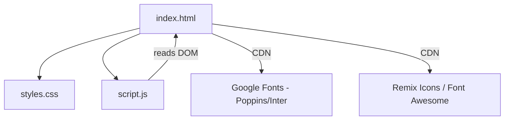
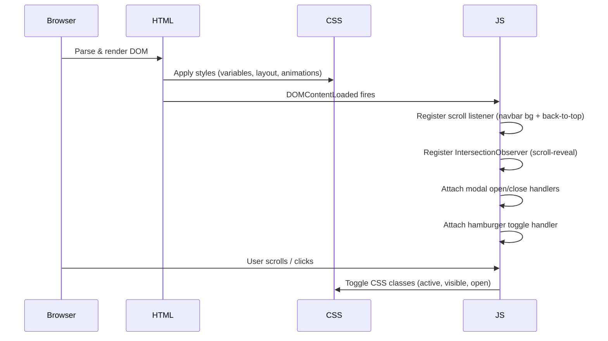

# Design Document

## Overview

Samra's portfolio is a single-page application (SPA) delivered as a static bundle: one `index.html`, one `styles.css`, and one `script.js`. No build step, no framework, no dependencies beyond two CDN-loaded resources (Google Fonts and an icon library). The site targets potential clients and employers on any device from 320 px to 1920 px wide.

The visual language is a dark-navy base (`#0f172a`) with glassmorphism cards, smooth CSS transitions, and Intersection Observer–driven scroll-reveal animations. Eight Flutter project cards open full-screen modals with YouTube iframe placeholders.

### Key Design Decisions

- **No framework**: Keeps the deliverable a single deployable folder with zero build tooling. Vanilla JS is sufficient for the interaction surface (navbar toggle, modal open/close, scroll events, Intersection Observer).
- **CSS custom properties for theming**: All colors, radii, and spacing are defined as `--var` tokens so the theme can be adjusted in one place.
- **Intersection Observer for scroll-reveal**: Avoids a scroll-event listener on the main thread; more performant and battery-friendly on mobile.
- **`prefers-reduced-motion` media query**: Wraps all animation declarations so users who opt out of motion get a static but fully functional experience.

---

## Architecture

The site is a three-file static application with no runtime dependencies beyond CDN resources loaded at page start.

```
portfolio/
├── index.html      # Markup: all sections, project data embedded as HTML
├── styles.css      # All visual styles, CSS variables, responsive breakpoints
└── script.js       # All interactivity: navbar, modals, scroll-reveal, back-to-top
```

### Dependency Graph



### Runtime Flow



---

## Components and Interfaces

### 1. Navbar

**Markup**: `<nav id="navbar">` containing `<a>` anchor links and a `<button class="hamburger">`.

**Behaviour**:
- On scroll > 50 px: add class `navbar--scrolled` → CSS applies `backdrop-filter: blur(12px)` + semi-transparent background.
- Hamburger click: toggle class `nav-menu--open` on the `<ul>` menu.
- Menu link click: remove `nav-menu--open`.
- All section links use `href="#section-id"` with `scroll-behavior: smooth` on `<html>`.

**CSS classes**:
| Class | Trigger | Effect |
|---|---|---|
| `navbar--scrolled` | scroll > 50 px | blur background |
| `nav-menu--open` | hamburger click | show vertical dropdown |

### 2. Hero Section

**Markup**: `<section id="hero">` with `<h1>`, `<p class="title">`, `<p class="tagline">`, and two `<a>` CTA buttons.

**Behaviour**: Pure CSS animation — `@keyframes fadeInUp` applied to heading, title, tagline, and buttons with staggered `animation-delay`.

### 3. About Section

**Markup**: `<section id="about">` with a two-column flex layout (avatar/illustration left, text right on desktop; stacked on mobile).

### 4. Skills Section

**Markup**: `<section id="skills">` with a `<div class="skills-grid">` containing `<span class="skill-tag">` elements.

**Behaviour**: CSS `:hover` applies `transform: scale(1.08)` and a highlight color. Scroll-reveal via `IntersectionObserver`.

### 5. Projects Section

**Markup**: `<section id="projects">` with `<div class="projects-grid">` containing eight `<article class="project-card">` elements.

Each card:
```html
<article class="project-card" data-project="ityrecare">
  <div class="card-thumbnail"></div>
  <div class="card-body">
    <h3 class="card-title">ItyreCare</h3>
    <p class="card-desc">…</p>
    <div class="card-tags">…</div>
    <button class="btn-details" data-project="ityrecare">View Details</button>
  </div>
</article>
```

**Grid breakpoints**:
| Viewport | Columns |
|---|---|
| < 600 px | 1 |
| 600 – 1024 px | 2 |
| > 1024 px | 3 |

### 6. Project Modal

**Markup**: One `<div id="modal-overlay" class="modal-overlay">` containing `<div class="modal-content">`. A single overlay element is reused for all projects; JS populates it dynamically from a `PROJECT_DATA` map.

**Behaviour**:
- Open: populate content from `PROJECT_DATA[id]`, add class `modal--open` to overlay, set `document.body.style.overflow = 'hidden'`.
- Close triggers: close button click, overlay background click (target === overlay), `Escape` keydown.
- Close: remove `modal--open`, restore `document.body.style.overflow = ''`.
- Animation: CSS `opacity` + `transform: scale(0.95→1)` transition on `.modal-content`.

**JS interface**:
```js
function openModal(projectId)   // populates and shows modal
function closeModal()           // hides modal, restores scroll
```

### 7. Contact Section

**Markup**: `<section id="contact">` with icon+link rows for email, LinkedIn, GitHub. All links have `target="_blank" rel="noopener noreferrer"`.

### 8. Back-to-Top Button

**Markup**: `<button id="back-to-top">` fixed bottom-right.

**Behaviour**:
- Hidden (opacity 0, pointer-events none) when scroll < 300 px.
- Visible (opacity 1) when scroll ≥ 300 px, with CSS transition.
- Click: `window.scrollTo({ top: 0, behavior: 'smooth' })`.

### 9. Scroll-Reveal System

**Implementation**: A single `IntersectionObserver` instance with `threshold: 0.15`. Observed elements start with class `reveal` (opacity 0, translateY 30 px). When they enter the viewport the observer adds class `reveal--visible` (opacity 1, translateY 0, transition 0.6 s ease).

Elements observed: `.about-content`, `.skill-tag`, `.project-card`, `.contact-content`.

`prefers-reduced-motion` check:
```js
const prefersReduced = window.matchMedia('(prefers-reduced-motion: reduce)').matches;
if (!prefersReduced) { /* set up observer */ }
```

---

## Data Models

### PROJECT_DATA

A plain JS object (or `const` map) keyed by project slug. Defined in `script.js`.

```js
const PROJECT_DATA = {
  ityrecare: {
    name: "ItyreCare",
    description: "Full description…",
    features: ["Feature 1", "Feature 2", "…"],
    techStack: ["Flutter", "Firebase", "REST APIs", "…"],
    youtubeId: "PLACEHOLDER_ID"   // or null
  },
  // … 7 more entries
};
```

**Projects** (8 total):

| Slug | Display Name |
|---|---|
| `ityrecare` | ItyreCare |
| `sushi-guide` | Sushi Guide |
| `lama` | Lama |
| `junction` | Junction |
| `expatio` | Expatio |
| `getfit` | GetFit |
| `selectnelect` | SelectnElect |
| `asas` | ASAS |

### CSS Custom Properties (Design Tokens)

Defined on `:root` in `styles.css`:

```css
:root {
  /* Colors */
  --color-bg:          #0f172a;
  --color-surface:     rgba(255, 255, 255, 0.05);
  --color-border:      rgba(255, 255, 255, 0.1);
  --color-accent:      #6366f1;   /* indigo */
  --color-accent-alt:  #8b5cf6;   /* violet */
  --color-text:        #e2e8f0;
  --color-text-muted:  #94a3b8;

  /* Typography */
  --font-primary:      'Poppins', 'Inter', sans-serif;
  --fs-xl:             clamp(2.5rem, 6vw, 4.5rem);
  --fs-lg:             clamp(1.5rem, 3vw, 2.25rem);
  --fs-md:             1.125rem;
  --fs-sm:             0.875rem;

  /* Spacing */
  --space-section:     clamp(4rem, 8vw, 8rem);
  --space-card-pad:    1.5rem;

  /* Shape */
  --radius-card:       16px;
  --radius-btn:        8px;

  /* Effects */
  --blur-glass:        blur(12px);
  --shadow-card:       0 4px 24px rgba(0, 0, 0, 0.4);
  --transition-base:   0.3s ease;
}
```

### Modal State

Modal state is managed entirely through CSS class presence — no JS state object needed:

| State | DOM indicator |
|---|---|
| Modal open | `#modal-overlay.modal--open` |
| Modal closed | `#modal-overlay` (no `modal--open`) |
| Body scroll locked | `document.body` has `overflow: hidden` inline style |

---

## Correctness Properties

*A property is a characteristic or behavior that should hold true across all valid executions of a system — essentially, a formal statement about what the system should do. Properties serve as the bridge between human-readable specifications and machine-verifiable correctness guarantees.*

This feature is primarily a static HTML/CSS/JS UI with DOM manipulation. The vast majority of requirements describe visual layout, CSS transitions, and browser rendering — none of which are amenable to property-based testing. However, there are two pure logic functions in `script.js` that have meaningful input variation and universal properties:

1. **`isScrolled(scrollY, threshold)`** — determines whether the navbar/back-to-top button should be in their "scrolled" state.
2. **`getModalContent(projectId, projectData)`** — looks up project data and returns a content object for the modal.

### Property 1: Scroll threshold is a total function

*For any* non-negative scroll position `y` and positive threshold `t`, `isScrolled(y, t)` SHALL return `true` if and only if `y > t`, and `false` otherwise — with no exceptions or undefined returns.

**Validates: Requirements 2.4, 10.2, 10.3**

### Property 2: Modal content lookup round-trip

*For any* project slug that exists in `PROJECT_DATA`, calling `getModalContent(slug, PROJECT_DATA)` SHALL return an object whose `name`, `description`, `features`, and `techStack` fields are strictly equal to the values stored under that slug in `PROJECT_DATA`.

**Validates: Requirements 7.2**

### Property 3: Unknown project slug returns null/undefined safely

*For any* string that is NOT a key in `PROJECT_DATA`, calling `getModalContent(slug, PROJECT_DATA)` SHALL return `null` (or a sentinel value) rather than throwing an exception.

**Validates: Requirements 7.1**

> **Note on PBT scope**: Properties 1–3 cover the only pure, input-varying logic in the codebase. All other requirements (layout, animations, responsive breakpoints, DOM events, CSS classes) are best validated through visual regression tests, snapshot tests, and manual cross-device QA — not property-based testing.

---

## Error Handling

| Scenario | Handling |
|---|---|
| CDN resource fails to load (fonts/icons) | Site degrades gracefully — system sans-serif font renders, icon text labels remain readable |
| `PROJECT_DATA[id]` lookup returns undefined | `openModal` guards with a null check; modal does not open, console.warn is emitted |
| `IntersectionObserver` not supported | Feature-detect before instantiating; elements remain visible (no `reveal` class added) |
| `backdrop-filter` not supported | CSS `@supports` fallback uses a solid semi-transparent background |
| YouTube iframe blocked (CSP / no network) | `<iframe>` shows browser's native fallback; rest of modal content is unaffected |

---

## Testing Strategy

### Unit Tests (Vitest or Jest — optional, for pure functions)

Focus on the two extractable pure functions:

- `isScrolled(y, threshold)` — test boundary values: `y === threshold`, `y === threshold - 1`, `y === threshold + 1`, `y === 0`.
- `getModalContent(id, data)` — test all 8 valid slugs return correct shape; test unknown slug returns null; test empty string input.

### Property-Based Tests

Use [fast-check](https://github.com/dubzzz/fast-check) (JavaScript PBT library). Minimum 100 iterations per property.

**Property 1 test** — `isScrolled` total function:
```js
// Feature: flutter-portfolio-website, Property 1: scroll threshold is a total function
fc.assert(fc.property(
  fc.nat(),           // scrollY ≥ 0
  fc.nat({ min: 1 }), // threshold > 0
  (y, t) => {
    const result = isScrolled(y, t);
    return typeof result === 'boolean' && result === (y > t);
  }
), { numRuns: 100 });
```

**Property 2 test** — modal content round-trip:
```js
// Feature: flutter-portfolio-website, Property 2: modal content lookup round-trip
const slugArb = fc.constantFrom(...Object.keys(PROJECT_DATA));
fc.assert(fc.property(slugArb, (slug) => {
  const content = getModalContent(slug, PROJECT_DATA);
  return content !== null
    && content.name === PROJECT_DATA[slug].name
    && content.description === PROJECT_DATA[slug].description
    && Array.isArray(content.features)
    && Array.isArray(content.techStack);
}), { numRuns: 100 });
```

**Property 3 test** — unknown slug safety:
```js
// Feature: flutter-portfolio-website, Property 3: unknown project slug returns null safely
const validSlugs = new Set(Object.keys(PROJECT_DATA));
fc.assert(fc.property(
  fc.string().filter(s => !validSlugs.has(s)),
  (slug) => {
    const result = getModalContent(slug, PROJECT_DATA);
    return result === null || result === undefined;
  }
), { numRuns: 100 });
```

### Integration / Manual QA Checklist

Since the bulk of requirements are visual and browser-based, the following manual checks are required:

- [ ] Navbar sticks at top across all scroll positions (Chrome, Firefox, Safari, mobile)
- [ ] Hamburger menu opens/closes correctly at < 768 px viewport
- [ ] All 8 project modals open with correct content and close via button, overlay click, and Escape key
- [ ] Body scroll is locked while modal is open and restored on close
- [ ] Scroll-reveal fires for About, Skills, Projects, Contact sections
- [ ] `prefers-reduced-motion` disables animations (test via DevTools emulation)
- [ ] Back-to-top button hidden at top, visible after 300 px scroll, scrolls to top on click
- [ ] Responsive grid: 1 col at 375 px, 2 col at 768 px, 3 col at 1280 px
- [ ] All contact links open in new tab
- [ ] `backdrop-filter` fallback renders correctly in browsers without support
- [ ] CDN font/icon fallback renders acceptably with network throttled to offline
